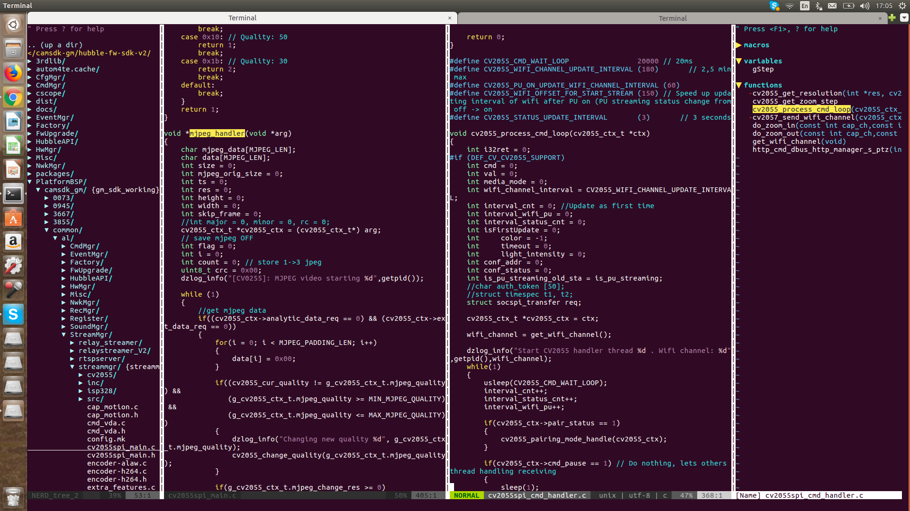

How to use vim like IDE

The vi editor is a very powerful tool and when you use it with plugin you can use vim like a IDE to code any
programming you want. 

you  can install any plugin for vim at https://vimawesome.com/ 
there are many way to install plugin for vim like install from Vundle, NeoBundle ,VimPlug, Pathogen . in here
i already use Pathogen, because it easy to use for me .

// below is essential Vim plugins for programer 
1. NERDTree 
2.  fzf
3. lightline
4. supertab 
5. tagbar 
6. taglist.vim
7. vim-autoclose
8. ctags
9. cscope 

// Note : need copy gentags file into your Linux machine at /usr/local/bin/ 
// ===how to use gentags file ====
assuming that your directory workplace is /home/giann/working/ 

=> cd /home/giann/working/
   ctags -R .
   gentag
=> done . now you can you vim editor like IDE 
